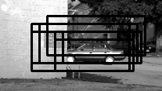
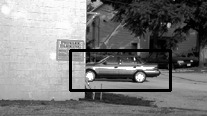
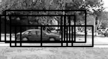
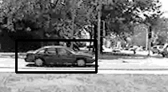
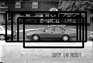
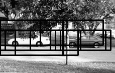
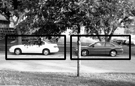

# object-detector
Object Detector using HOG as descriptor and Linear SVM as classifier. | [Video](https://www.youtube.com/watch?v=SPXocFBjr70)

## Run the code

```bash
git clone https://github.com/bikz05/object-detector.git
cd object-detector/bin
test-object-detector
```

_The `test-object-detector` will download the [UIUC Image Database for Car Detection](https://cogcomp.cs.illinois.edu/Data/Car/) and train a classifier to detect cars in an image. The SVM model files will be stored in `data/models`, so that they can be resused later on._

# About the modules

1. `extract-features.py` -- This module is used to extract HOG features of the training images.
2. `train-classifier.py` -- This module is used to train the classifier.
3. `nms.py` -- This module performs Non Maxima Suppression.
4. `test-classifier.py` -- This module is used to test the classifier using a test image


## Some of the results

#### Test Image 1
_Detections before NMS_



_Detections after NMS_


#### Test Image 2
_Detections before NMS_



_Detections after NMS_


#### Test Image 3
_Detections before NMS_



_Detections after NMS_


#### Test Image 4
_Detections before NMS_



_Detections after NMS_



## Useful tutorials

1. [Histogram of Oriented Gradients and Object Detection](http://www.pyimagesearch.com/2014/11/10/histogram-oriented-gradients-object-detection/)
2. [Image Pyramids with Python and OpenCV](http://www.pyimagesearch.com/2015/03/16/image-pyramids-with-python-and-opencv/)
3. [Sliding Windows for Object Detection with Python and OpenCV](http://www.pyimagesearch.com/2015/03/23/sliding-windows-for-object-detection-with-python-and-opencv/)
4. [Non-Maximum Suppression for Object Detection in Python](http://www.pyimagesearch.com/2014/11/17/non-maximum-suppression-object-detection-python/)
5. [(Faster) Non-Maximum Suppression in Python](http://www.pyimagesearch.com/2015/02/16/faster-non-maximum-suppression-python/)
6. [Texture Matching using Local Binary Patterns (LBP), OpenCV, scikit-learn and Python](http://hanzratech.in/2015/05/30/local-binary-patterns.html)
